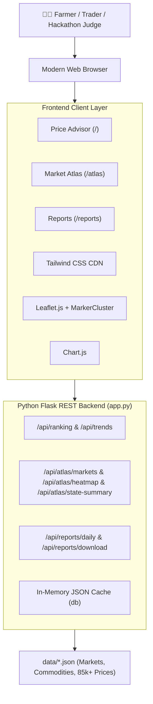

# 🌾 Smart Mandi Price Advisor & National Agriculture Market Atlas
### (स्मार्ट मंडी मूल्य सलाहकार एवं राष्ट्रीय कृषि बाज़ार एटलस)

> **Hackathon-winning agricultural market intelligence & decision-support platform** inspired by `agmarknet.gov.in` and `enam.gov.in`. Empowers farmers and agricultural traders to identify the most profitable mandis, analyze real-time price trends across India, estimate transport logistics, and explore geospatial market distributions through an interactive Market Atlas.

---

## 🚀 Quick Start

```bash
# 1. Install dependencies
pip install flask flask-cors

# 2. Generate seed data (51 mandis, 31 crops, 85,590 historical records)
python data/seed_data.py

# 3. Start the application server
python app.py
```

Then open **http://localhost:5000/intro** in your browser.

---

## 🌟 Key Functional Modules

### 1. 🌾 Smart Mandi Price Advisor (`/`)
- **Multi-Mandi Profit Ranking**: Calculates Expected Net Return:
  $$\text{Net Return} = (\text{Modal Price} \times \text{Quantity}) - \text{Transport Cost} - \text{Commission}$$
- **Haversine Distance & Logistics**: Estimates road transit costs using farmer's GPS coordinates or manual selection.
- **Explainable Recommendation**: Plain-English AI rationale explaining why the #1 market was chosen (price advantage vs. transit trade-offs).
- **Real-Time "What-If" Sensitivity Analysis**: Sliders for quantity, transport rates, and commission fees with debounced, instantaneous ranking updates without reloading.
- **Comparative Visual Analytics**:
  - Top-10 Modal Price comparison bar chart
  - Top-5 Stacked Net Return breakdown (Gross Revenue, Transport, Commission)
  - 30-Day Min/Max/Modal price history line chart
  - Dynamic Leaflet route preview from farm to top recommended mandi.

### 2. 🗺️ National Agriculture Market Atlas (`/atlas`)
- **Full-Screen GIS Spatial Map**: Displays all 51 mandis across India on page load.
- **Interactive State Choropleth (Heatmap)**: Color-codes states by average commodity price or arrival volumes using GeoJSON boundaries.
- **Commodity Price Heatmap Pins**: Color-coded pins (green for below national avg, yellow for near avg, red for high-price hotspots) with dynamic color intensity.
- **Market Clustering**: Groups nearby mandis with count badges that expand on zoom (Leaflet.markercluster).
- **State & District Drill-Down**: Click any state polygon or summary card to auto-zoom and isolate state-level markets with breadcrumb navigation.
- **Commodity Intelligence Dashboard**: Slide-up bottom analytics drawer showing:
  - National Average Price
  - Highest & Lowest Markets with price spread
  - Minimum Support Price (MSP) comparison and delta percentage
  - Top 10 mandis horizontal bar chart
  - State-by-state price comparison chart.

### 3. 📋 Daily Mandi Price Reports & Downloads (`/reports`)
- **Filterable Daily Price Table**: Tabular view of min, max, modal prices, and 7-day trends with sticky headers.
- **Comprehensive Multi-Filter Bar**: Filter by Date, State, Commodity, Category, or search by Mandi name.
- **Export & Print**:
  - One-click **CSV Download** via backend streaming (`/api/reports/download`)
  - Print-friendly layout that strips away navigation and controls.
- **Dynamic Pagination**: Client and server-side paginated browsing through 950+ daily market records.

### 4. 🔴 Real-Time Daily Mandi Data & AGMARKNET Feed (`/live`)
- **Live Pan-India Market Stream**: Connects to the official Government of India `data.gov.in` AGMARKNET API (Resource `9ef84268-d588-465a-a308-a864a43d0070`).
- **Complete State & District Granularity**: Real-time modal, min, and max prices covering 18+ agricultural states and 80+ districts across India.
- **Cascading Dropdowns**: Selecting a State dynamically populates its respective districts.
- **Key Summary Metrics**: Real-time stats showing today's reporting mandis, total active records, and highest/lowest priced crops nationwide.
- **Resilient Fallback & Cache Engine**: Local high-speed caching with self-healing bootstrap, retry backoffs, and instant client filtering.
- **Auto-Refresh Countdown**: Live 5-minute polling ticker with manual refresh option and one-click CSV export.

### 5. 🎬 4-Slide Cinematic Intro Experience (`/intro`)
- **Visual Storytelling Journey**:
  1. **Smart** (`smart.jpg`): Modern agritech guidance, drone monitoring, and AI price intelligence.
  2. **Compare** (`compare.jpg`): Geospatial cross-mandi price disparity analytics.
  3. **Calculate** (`calculate.jpg`): Precision freight logistics, mileage, and commission deductions.
  4. **Earn More** (`earn_more.jpg`): Bumper harvest profit realization and explainable recommendations.
- **Cinematic Features**:
  - Ken Burns slow-motion zoom & pan effect with glassmorphism overlays.
  - 4-Segment story progress bar with auto-advance and interactive slide jump tabs.
  - Play/Pause toggle, keyboard controls (Arrow Left/Right, Space, Escape), and mobile swipe support.
  - Direct CTA buttons leading seamlessly into the live Price Advisor platform.

---

## 📊 Agricultural Dataset (Mirroring AGMARKNET & eNAM)

- **51 Major Indian Mandis** across 14 States & UTs (e.g., Azadpur, Lasalgaon, Vashi, Unjha, Mandsaur, Guntur, Khanna, Abohar, Meerut, etc.)
- **31 Commodities** covering 7 Categories:
  - *Cereals*: Wheat, Rice (Paddy), Maize, Bajra, Jowar
  - *Pulses*: Chana (Gram), Tur (Arhar), Moong, Urad
  - *Vegetables*: Onion, Tomato, Potato, Garlic, Ginger, Green Chilli, Brinjal, Cauliflower, Cabbage, Lady Finger
  - *Fruits*: Banana, Apple, Mango
  - *Oilseeds*: Soybean, Groundnut, Mustard, Sunflower
  - *Spices*: Turmeric, Coriander, Cumin
  - *Cash Crops*: Cotton, Sugarcane
- **85,590 Daily Price Records** spanning a 90-day timeline with realistic market volatility, seasonality, and arrival volumes.
- **Official MSP Benchmarks** included for central crops.

---

## 🛠️ Architecture & Tech Stack



| Layer | Technologies |
|---|---|
| **Backend** | Python 3, Flask, Flask-CORS |
| **Styling & Icons** | Tailwind CSS, Font Awesome 6 |
| **Geospatial & Maps** | Leaflet 1.9.4, Leaflet.markercluster 1.5.3, OpenStreetMap, GeoJSON |
| **Data Visualization** | Chart.js 4.x |
| **Data Storage** | Structured JSON with in-memory indexes and caching |

---

## 🔌 API Reference Guide

### 1. Advisor & General APIs
- `GET /api/commodities`: List all 31 commodities with MSP data and categories.
- `GET /api/states`: List distinct states with active mandis.
- `GET /api/markets`: Get markets with optional state and commodity price filters.
- `POST /api/ranking`: Calculate net return ranking based on farmer coordinates, quantity, and transport rate.
- `GET /api/trends`: Historical daily prices for a given market and commodity.
- `GET /api/market-detail/<id>`: Detailed infrastructure and commodity profile for a mandi.
- `GET /api/dashboard-stats`: Aggregate metrics (highest price, top volatile crop, category averages).

### 2. Atlas APIs
- `GET /api/atlas/markets`: Complete geographic list of all mandis with top-5 commodities and arrival totals.
- `GET /api/atlas/heatmap?commodity_id=<id>`: Relative price intensity (0.0 to 1.0) and national delta for each market.
- `GET /api/atlas/state-summary?commodity_id=<id>`: State-aggregated average prices, arrival tonnes, and mandi counts.
- `GET /api/atlas/commodity-summary?commodity_id=<id>`: National statistics, highest/lowest price spreads, MSP comparison, top-10 list, and state averages.

### 3. Reporting APIs
- `GET /api/reports/daily?date=&state=&commodity_id=&page=1&per_page=50`: Paginated daily price records with metadata.
- `GET /api/reports/download?date=&state=&commodity_id=`: Direct CSV file download.

### 4. Real-Time Mandi Live APIs
- `GET /live`: Full-screen live price portal with auto-refresh and CSV export.
- `GET /api/live/prices?state=&district=&commodity=&page=1&per_page=50`: Pan-India real-time daily price stream.
- `GET /api/live/states`: List all states reporting prices today.
- `GET /api/live/districts?state=<state>`: Cascading district list for a selected state.
- `GET /api/live/commodities`: List all agricultural commodities trading today.
- `GET /api/live/summary`: Overview statistics (total records, states active, high/low price crops, source status).
- `POST /api/live/refresh`: Trigger manual live cache refresh (supports custom `api_key`).

---

## 🔮 Future Scope & Production Roadmap

1. **Live AGMARKNET & eNAM Scraper / Webhooks**: Real-time synchronization with government APMC API feeds.
2. **Predictive AI Price Forecasting**: Integration of Prophet / ARIMA time-series models for 7-day and 14-day forward price forecasts.
3. **Multilingual Voice & WhatsApp Interface**: Voice search in Hindi, Marathi, Telugu, Punjabi, and automated WhatsApp price alerts via Twilio/Meta Business API.
4. **Logistics & Aggregated Truck Pooling**: Connect smallholder farmers to share mini-truck transport costs to distant high-paying mandis.
5. **Cold Storage & Warehousing Locator**: Display nearby WDRA-registered cold storage facilities to help farmers avoid distress sales during price dips.

---

## 📜 License

Built with ❤️ for Indian Farmers and the Open Agri-Tech Community. MIT License.
